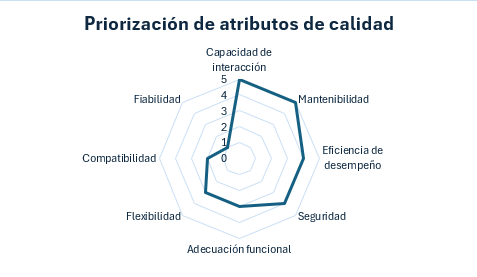

# Entrega final - Escenarios y Tacticas aplicadas al proyecto

## Priorización de atributos de calidad

|Atributo de calidad|Importancia (0-5)|Justificación|
|---|---|---|
|Capacidad de interacción|5|El sistema debe cumplir correctamente con las funciones básicas de identificación de debilidades y recomendación de contenidos, pero no requiere una cobertura funcional extremadamente amplia en una primera versión. Se prioriza tener funciones clave bien implementadas antes que incorporar muchas características adicionales.|
|Mantenibilidad|5|El tutor inteligente debe responder rápidamente al analizar el desempeño del estudiante y generar recomendaciones personalizadas. Tiempos de respuesta lentos afectarían la experiencia de aprendizaje y disminuirían la interacción del usuario. Sin embargo, no se requiere procesamiento en tiempo real crítico, por eso no se asigna 5.|
|Eficiencia de desempeño|4|Aunque es deseable integrarse con LMS o plataformas educativas externas, inicialmente el sistema puede operar de manera independiente. La interoperabilidad no es crítica en etapas tempranas del proyecto y puede evolucionar posteriormente.|
|Seguridad|4|Es uno de los atributos más importantes porque los estudiantes interactuarán constantemente con la plataforma. El sistema debe ser intuitivo, claro y fácil de usar para evitar abandono y facilitar el aprendizaje autónomo. Una mala experiencia de usuario comprometería directamente la efectividad del tutor inteligente.|
|Adecuación funcional|3|Aunque el sistema debe funcionar correctamente, un fallo ocasional no representa un riesgo crítico como en sistemas médicos o financieros. El usuario puede reintentar acciones sin consecuencias graves. Por ello, se acepta sacrificar cierto nivel de robustez extrema en favor de otros atributos más relevantes.|
|Flexibilidad|3|El sistema manejará datos académicos y posiblemente información personal de los estudiantes. Es importante proteger la confidencialidad y el acceso a los datos, aunque no se trata de información altamente sensible como datos bancarios o clínicos, por lo que no se prioriza con 5.|
|Compatibilidad|2|Los modelos pedagógicos, contenidos y algoritmos de recomendación evolucionarán constantemente. El sistema debe poder modificarse fácilmente para incorporar nuevas estrategias de aprendizaje, corregir reglas y adaptar contenidos sin rehacer toda la arquitectura.|
|Fiabilidad|1|Es importante permitir futuras adaptaciones a distintos cursos o metodologías educativas, pero inicialmente el enfoque está en validar el funcionamiento principal del tutor inteligente antes de maximizar la adaptabilidad.|

## Escenarios

- **Escenario 1: Estudiante envía evaluación sin finalizar**

|Item|Descripción|
|---|---|
|Atributo de calidad|**Capacidad de interacción** - Protección contra errores de usuario|
|Fuente de estímulo|Estudiante|
|Estímulo|El estudiante intenta enviar una evaluación incompleta o selecciona respuestas accidentalmente antes de finalizar.|
|Artefacto|Módulo de evaluación|
|Entorno|Durante una evaluación|
|Respuesta|El sistema:   alerta sobre preguntas sin responder,   permite revisar respuestas antes de enviar,   guarda progreso automáticamente,   solicita confirmación final,   recupera sesión si ocurre cierre inesperado del navegador.|
|Métrica de respuesta|Recuperación de sesión exitosa en al menos 98% de interrupciones.   Impide el envío de cuestionarios incompletos el 100% de las veces.   Tiempo de recuperación menor a 5 segundos.|
|Riesgos o implicaciones|Pérdida de respuestas por desconexiones.   Duplicidad de envíos.   Inconsistencias de sesión.   Sobrecarga por persistencia continua.|
|Tácticas arquitectónicas|Autosave incremental.   Persistencia temporal desacoplada.   Session recovery.   Caché temporal distribuida|

- **Escenario 2: Modificación de reglas de evaluación académica**

|Item|Descripción|
|---|---|
|Atributo de calidad|**Mantenibilidad** - Capacidad para ser modificado|
|Fuente de estímulo|Docente|
|Estímulo|El docente desea agregar un nuevo campo a la rubrica de calificación|
|Artefacto|Módulo de evaluación|
|Entorno|Un día cualquiera en el ambiente productivo|
|Respuesta|El sistema:   centraliza reglas académicas en un único componente,   minimiza impacto en evaluaciones existentes,   mantiene trazabilidad de cambios.|
|Métrica de respuesta|Cambio implementado en menos de 2 días.   Menos de 3 módulos afectados.   Cobertura automatizada superior al 80% sobre reglas modificadas.|
|Riesgos o implicaciones|Alta propagación de cambios.   Riesgo de inconsistencias históricas.   Dependencia excesiva del equipo técnico.|
|Tácticas arquitectónicas|Versionamiento de reglas.   APIs desacopladas|

- **Escenario 3: Protección contra modificación no autorizada de resultados de evaluación**

|Item|Descripción|
|---|---|
|Atributo de calidad|**Seguridad** - Integridad|
|Fuente de estímulo|Usuario malicioso autenticado o atacante interno.|
|Estímulo|Un usuario intenta alterar calificaciones, resultados diagnósticos o rutas de aprendizaje directamente desde solicitudes manipuladas o acceso indebido a la base de datos|
|Artefacto|Módulo de evaluación y módulo de clasificación|
|Entorno|Sistema en operación normal con múltiples usuarios concurrentes.|
|Respuesta|El sistema:   rechaza modificaciones no autorizadas,   valida permisos y contexto de operación,   registra auditoría inmutable de cambios,   detecta inconsistencias de integridad,   preserva trazabilidad histórica de resultados.|
|Métrica de respuesta|100% de modificaciones no autorizadas bloqueadas.   Trazabilidad completa de cambios críticos.   Detección de inconsistencias menor a 5 segundos.   Cero pérdida de integridad en resultados persistidos.|
|Riesgos o implicaciones|Escalamiento indebido de privilegios.   Manipulación directa de endpoints.   Alteración de datos desde accesos internos.   Falta de trazabilidad de cambios.   Inconsistencias entre servicios distribuidos.|
|Tácticas arquitectónicas|RBAC y políticas de autorización centralizadas.   Auditoría inmutable.   Validación server-side obligatoria.   Control transaccional ACID.   Principio de menor privilegio.|

- **Escenario 4: Respuesta rápida durante evaluaciones en línea**

|Item|Descripción|
|---|---|
|Atributo de calidad|**Eficiencia en desempeño** - Comportamiento temporal|
|Fuente de estímulo|Estudiantes concurrentes|
|Estímulo|Miles de estudiantes responden preguntas simultáneamente de la evaluación|
|Artefacto|Módulo de evaluación|
|Entorno|Pico de carga académica durante evaluaciones masivas|
|Respuesta|El sistema:   registra respuestas sin pérdida,   mantiene tiempos de respuesta bajos,   evita bloqueos de sesión,   preserva continuidad de la evaluación.|
|Métrica de respuesta|Tiempo de respuesta menor a 2 segundo por interacción.   Soporte de al menos 1.000 estudiantes concurrentes.   Pérdida de respuestas igual a 0.   Disponibilidad superior al 99.9% durante evaluación.|
|Riesgos o implicaciones|Saturación de base de datos.   Contención de escritura concurrente.   Timeouts de sesión.   Sobrecarga de red.   Bloqueos transaccionales.   Caída parcial del sistema durante picos|
|Tácticas arquitectónicas|Escalamiento horizontal.   Escritura asíncrona controlada.   Uso de colas de mensajería.   CQRS.|
